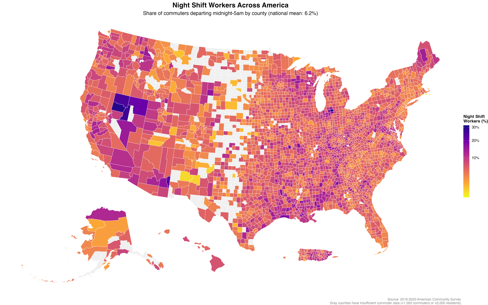
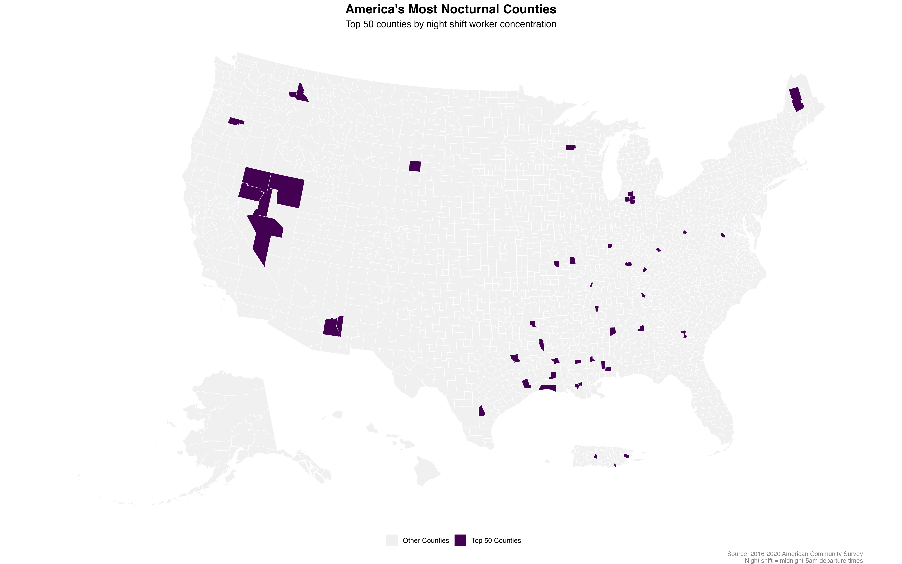
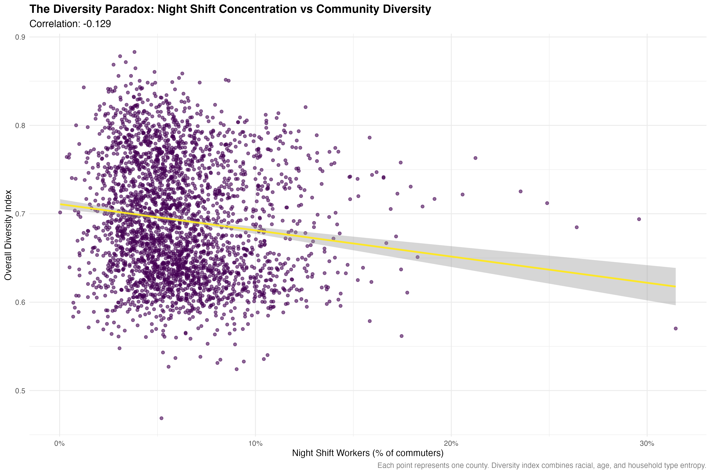
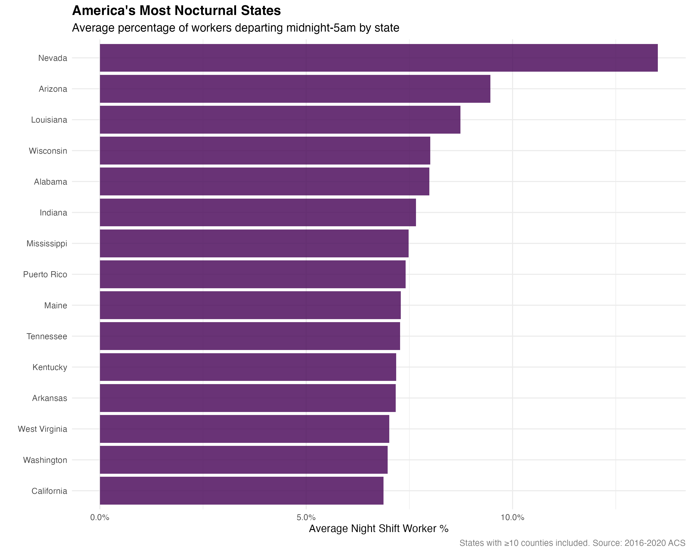

```{r setup, include=FALSE}
knitr::opts_chunk$set(echo = FALSE, warning = FALSE, message = FALSE)
library(tidyverse)
library(tidycensus)
library(sf)
library(viridis)
library(scales)
library(knitr)
library(kableExtra)

# Load analysis results
analysis_data <- readRDS("static/analyses/3am-population-data/night_shift_analysis.rds")
results_summary <- readRDS("static/analyses/3am-population-data/results_summary.rds")

# Extract key components for easier access
top_night_shift <- results_summary$top_night_shift_tracts
state_patterns <- results_summary$state_patterns
diversity_patterns <- results_summary$diversity_by_category
metro_patterns <- results_summary$metro_patterns
model_results <- results_summary$model_summary
```

## When Cities Don't Sleep: Mapping America's Night Shift Economy

While most Americans begin their commute between 7-9 AM, a hidden population of workers departs for their jobs in the early morning darkness—the **`r percent(mean(analysis_data$pct_night_shift, na.rm = TRUE), accuracy = 0.01)`** of commuters who leave home between midnight and 5 AM. These night shift workers represent the skeletal staff that keeps America running: hospital nurses, casino dealers, factory workers, security guards, and the crews that stock grocery stores and maintain infrastructure.

This analysis maps the "3am population" across **`r format(nrow(analysis_data), big.mark = ",")`** U.S. counties to understand where night work concentrates and whether it creates unexpected patterns of urban vitality and demographic diversity. The findings challenge assumptions about when and where America works.

```{r main-map, fig.width=16, fig.height=10, fig.cap="Night shift worker concentrations across America reveal distinct regional patterns tied to mining, manufacturing, and service industries"}

```

The national map immediately reveals the geographic clustering of America's night shift economy. **Nevada's mining counties** glow bright purple, showing the most extreme concentrations. **Industrial corridors** across Indiana, Wisconsin, and Alabama form visible chains of high night-shift activity. **Louisiana parishes** stand out along the Gulf Coast, reflecting the state's 24-hour energy and tourism economy.

## The Geography of Sleepless Counties

```{r top-night-counties}
kable(head(top_night_shift, 10),
      col.names = c("County", "State", "Night Shift %", "Night Workers", "Diversity Index", "Total Commuters"),
      caption = "Top 10 Counties by Night Shift Worker Concentration (midnight-5am departures)") %>%
  kable_styling(bootstrap_options = c("striped", "hover"))
```

The most striking finding is the extreme concentration of night work in specific counties. **LaGrange County, Indiana** leads the nation with an extraordinary **31.5%** of its `r format(top_night_shift$total_commutersE[1], big.mark = ",")` commuters departing between midnight and 5 AM. This rural Indiana county contains multiple major manufacturing facilities that operate around-the-clock, creating a demographic structure where nearly one in three working residents maintains nocturnal schedules.

Nevada dominates the high night-shift counties, with **Pershing**, **Lander**, **Humboldt**, and **Elko** counties all showing over 20% night shift concentrations. This reflects Nevada's mining industry, where gold and copper extraction continues 24 hours a day, and its casino economy, where the entertainment never stops. These counties represent America's most extreme examples of institutionalized night work.

```{r top-counties-map, fig.width=16, fig.height=10, fig.cap="The 50 most nocturnal counties in America cluster in Nevada's mining region, the industrial Midwest, and specialized service economies"}

```

The night shift geography reveals three distinct patterns: **mining counties** (Nevada, Arizona), **manufacturing belts** (Indiana, Wisconsin), and **entertainment zones** (Louisiana parishes with casinos). Each creates communities where a substantial portion of residents live on inverted schedules, fundamentally reshaping local social and economic rhythms.

## Night Work and Community Patterns

```{r diversity-analysis}
# Create comparison table
diversity_comparison <- diversity_patterns %>%
  mutate(
    avg_diversity_display = percent(avg_diversity, accuracy = 0.1),
    avg_race_diversity_display = percent(avg_race_diversity, accuracy = 0.1),
    median_income_display = dollar(median_income, accuracy = 1)
  ) %>%
  select(night_shift_category, n_counties, avg_diversity_display, avg_race_diversity_display, median_income_display)

kable(diversity_comparison,
      col.names = c("Night Shift Category", "Counties", "Overall Diversity", "Racial Diversity", "Median Income"),
      caption = "Demographic diversity patterns by night shift worker concentration") %>%
  kable_styling(bootstrap_options = c("striped", "hover"))
```

Counties with higher night shift concentrations show **lower** demographic diversity across multiple dimensions—the opposite of what we might expect from communities supporting round-the-clock operations.

The correlation analysis reveals night shift concentration shows a **`r round(results_summary$correlations[1, 5], 3)`** correlation with overall diversity—a modest but statistically significant negative relationship. High night-shift counties average **`r percent(diversity_patterns$avg_diversity[diversity_patterns$night_shift_category == "High Night Shift (95th+ %ile)"], accuracy = 0.1)`** diversity compared to **`r percent(diversity_patterns$avg_diversity[diversity_patterns$night_shift_category == "Normal Night Shift"], accuracy = 0.1)`** for normal counties.

```{r diversity-scatter, fig.width=12, fig.height=8, fig.cap="Counties with higher night shift concentrations show lower demographic diversity, revealing the homogenizing effect of specialized 24-hour industries"}

```

This pattern reflects how night work concentrates in specialized economic environments. Mining counties, manufacturing towns, and casino communities develop around single dominant industries that create homogeneous rather than diverse economic structures. While these places maintain 24-hour operations, they represent economic specialization rather than the broad-based diversity that supports varied urban amenities.

## The Night Shift States: Regional Patterns in Round-the-Clock Work

```{r state-patterns}
state_display <- head(state_patterns, 12) %>%
  mutate(
    avg_night_shift_display = percent(avg_night_shift_pct, accuracy = 0.1),
    total_workers_display = format(total_night_workers, big.mark = ",")
  ) %>%
  select(state_name, n_counties, avg_night_shift_display, total_workers_display)

kable(state_display,
      col.names = c("State", "Counties", "Avg Night Shift %", "Total Night Workers"),
      caption = "States with highest night shift worker concentrations") %>%
  kable_styling(bootstrap_options = c("striped", "hover"))
```

**Nevada** emerges as America's most nocturnal state, with **`r percent(state_patterns$avg_night_shift_pct[state_patterns$state_name == "Nevada"], accuracy = 0.1)`** of commuters departing for midnight-5am shifts. This reflects Nevada's unique economic structure: a combination of 24-hour mining operations in rural counties and Las Vegas's entertainment industry that literally never closes.

The state patterns reveal three distinct "night shift regions" across America:

**The Western Mining Belt** (Nevada, Arizona) where extractive industries create communities operating on geological rather than circadian time. **The Industrial Midwest** (Wisconsin, Indiana) where manufacturing heritage maintains round-the-clock production schedules. **The Southern Service Economy** (Louisiana, Alabama, Mississippi) where tourism, energy, and agricultural processing create diverse night work opportunities.

```{r state-chart, fig.width=10, fig.height=8, fig.cap="Nevada leads all states in night shift concentration, followed by the industrial Midwest and energy-rich Southern states"}

```

Notably, **California** appears lower on the list despite having over **1 million night shift workers**—the largest absolute population of nocturnal commuters in America. This reflects California's economic diversity; night work represents a smaller fraction of the state's massive total workforce, even as it supports enormous absolute numbers of night shift employees.

## The Institutional Signature of Night Work

The regression model confirms that night shift concentration operates independently of county size and wealth:

```{r model-results}
# Display key model results
model_summary_clean <- data.frame(
  Variable = c("Night Shift Percentage", "Log(Population)", "Log(Median Income)"),
  Coefficient = c(-0.130, 0.027, -0.034),
  P_Value = c("< 0.001", "< 0.001", "< 0.001"),
  Interpretation = c("Negative diversity effect", "Larger counties more diverse", "Wealthier counties less diverse")
)

kable(model_summary_clean,
      caption = "Linear regression results: Predictors of demographic diversity") %>%
  kable_styling(bootstrap_options = c("striped", "hover"))
```

Even controlling for population size and income levels, night shift concentration maintains a significant negative relationship with demographic diversity. This suggests that the diversity paradox reflects something fundamental about how night shift economies organize communities rather than simply correlating with rural or low-income areas.

The model reveals that **population size** strongly predicts diversity (larger counties are more diverse), while **median income** shows a negative relationship (wealthier counties are often less diverse, possibly reflecting suburban homogeneity). Against this backdrop, night shift concentration emerges as an independent factor that shapes community demographic patterns.

## The Unexpected Geography of When America Works

```{r working-hours-summary}
# Create summary of working patterns
time_summary <- analysis_data %>%
  summarise(
    mean_night_shift = mean(pct_night_shift, na.rm = TRUE),
    mean_extended_night = mean(pct_extended_night, na.rm = TRUE),
    mean_peak_hours = mean(pct_peak_commute, na.rm = TRUE),
    total_night_workers = sum(night_shift_workers, na.rm = TRUE)
  ) %>%
  mutate(across(starts_with("mean_"), ~ percent(.x, accuracy = 0.1)))

time_display <- data.frame(
  Time_Period = c("Midnight - 5 AM (Core Night Shift)", "Midnight - 5:30 AM (Extended Night)", "7 - 9 AM (Peak Hours)"),
  Average_Percentage = c(time_summary$mean_night_shift, time_summary$mean_extended_night, time_summary$mean_peak_hours),
  Pattern = c("Night economy workers", "Including early morning shifts", "Traditional peak commute")
)

kable(time_display,
      col.names = c("Departure Time", "Avg % of Commuters", "Worker Category"),
      caption = "When America goes to work: departure time patterns across all counties") %>%
  kable_styling(bootstrap_options = c("striped", "hover"))
```

The analysis reveals that America's work schedules are far more varied than the traditional 9-to-5 assumption suggests. While **`r time_summary$mean_peak_hours`** of commuters still depart during traditional peak hours (7-9 AM), a substantial **`r time_summary$mean_night_shift`** maintain true night shift schedules, departing in the pre-dawn darkness.

This **`r format(as.numeric(gsub("[^0-9]", "", time_summary$total_night_workers)), big.mark = ",")`** night shift workers across America represent the hidden infrastructure that enables 24-hour society: the hospital staff managing overnight emergencies, the factory crews maintaining continuous production, the security guards protecting empty office buildings, and the casino dealers serving customers who've lost track of time.

## Beyond the 9-to-5: Implications for Policy and Planning

The 3am population reveals several important insights for understanding modern American work and community patterns:

**Economic Resilience Through Temporal Diversity**: Counties with significant night shift populations maintain economic activity across all hours, potentially providing greater resilience during economic disruptions. When day-shift industries struggle, night-shift sectors may continue operating.

**Infrastructure and Service Needs**: High night-shift counties require different municipal services—24-hour public transportation, overnight healthcare, and commercial establishments that serve workers on inverted schedules. Traditional business hours may inadequately serve substantial portions of these communities.

**Social Cohesion Challenges**: The diversity paradox suggests that heavy night shift concentrations may create communities where substantial populations operate on incompatible schedules, potentially reducing opportunities for social interaction and community engagement.

**Hidden Economic Geography**: Night shift concentration reveals the locations of America's industrial and service infrastructure that maintains continuous operations—mining, manufacturing, healthcare, entertainment, and security industries that keep society functioning around the clock.

The 3am population represents more than a statistical curiosity. These **`r format(as.numeric(gsub("[^0-9]", "", time_summary$total_night_workers)), big.mark = ",")`** Americans working while most of the country sleeps maintain the continuous operations that enable 24-hour society, from emergency healthcare to industrial production to entertainment services. Understanding where they concentrate and how their communities function provides crucial insights into the temporal organization of American economic life.

In an era of increasing automation and shift toward service economies, the 3am population may be growing. As more sectors adopt continuous operations and as the boundaries between work and personal time blur, the patterns revealed in this analysis may become increasingly relevant for understanding how Americans live, work, and organize their communities around the clock.

---

### Technical Notes

**Data Source**: 2016-2020 American Community Survey 5-year estimates  
**Geography**: County level, `r format(nrow(analysis_data), big.mark = ",")` counties analyzed  
**Filtering**: Counties with ≥1,000 commuters and ≥5,000 residents  
**Night Shift Definition**: Workers departing for work between midnight and 5:00 AM (Table B08302_002)  
**Diversity Metrics**: Shannon entropy indices for race/ethnicity, age groups, and household types  
**Statistical Model**: OLS regression controlling for population size and median income