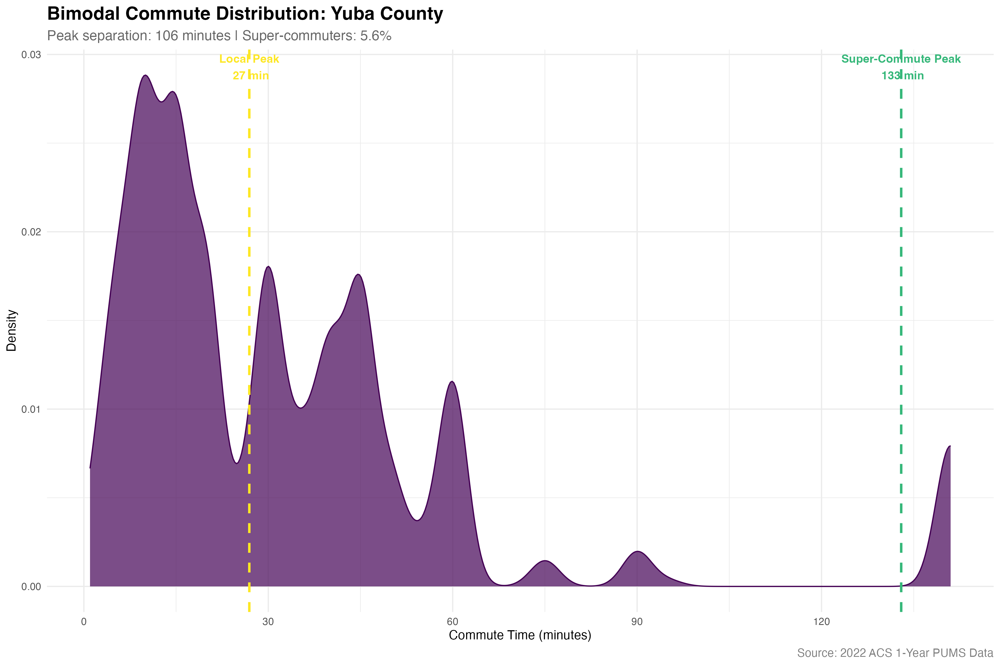
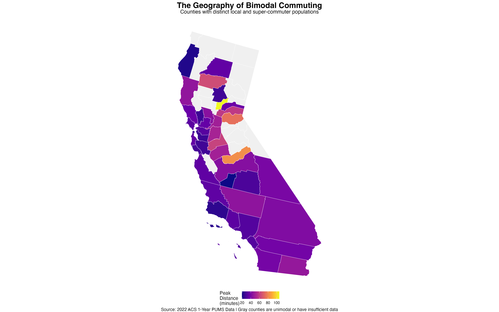
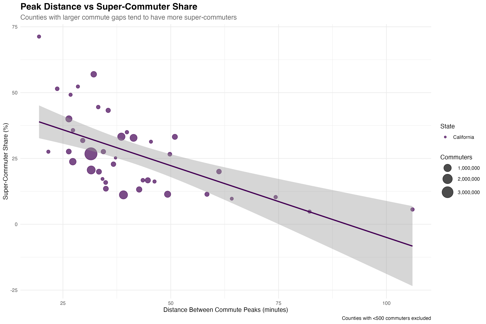

```{r setup, include=FALSE}
knitr::opts_chunk$set(echo = FALSE, warning = FALSE, message = FALSE)

# Load required libraries
library(tidyverse)
library(tidycensus)
library(sf)
library(viridis)
library(knitr)
library(kableExtra)
library(scales)

# Load pre-analyzed data from the R script
key_findings <- readRDS("static/analyses/bimodal-commute-data/key_findings.rds")
county_models <- readRDS("static/analyses/bimodal-commute-data/bimodal_commute_models.rds")
top_bimodal <- read_csv("static/analyses/bimodal-commute-data/top_bimodal_counties.csv")
state_patterns <- read_csv("static/analyses/bimodal-commute-data/state_bimodal_patterns.csv")
```

## The Hidden Story Behind "Average" Commute Times

The "average commute time" is among the most misleading statistics in American demographic data. When we see that a county has a mean commute of 25 minutes, we imagine a typical resident spending half an hour getting to work. But for many American counties, this average conceals a profound reality: **there is no typical commuter**.

Instead, these places house two distinct workforces sharing the same ZIP codes but living entirely different economic lives. Using individual-level commute data from **`r format(sum(county_models$n_commuters), big.mark = ",")`** California workers, we applied Gaussian mixture models to uncover counties where commute times follow not one bell curve, but two distinct peaks—a **local workforce** with conventional commutes and an army of **super-commuters** traveling vast distances to major economic hubs.

The results reveal a new geography of American economic dependence, quantified not by income or employment, but by the daily migrations that define how we live and work.

```{r example-plot, fig.width=12, fig.height=8, fig.cap=paste("Bimodal commute distribution for", key_findings$top_example$county, ", showing distinct local and super-commuter populations")}

```

## A Tale of Two Peaks: The **`r key_findings$top_example$county`** Story

Consider **`r key_findings$top_example$county`**, which emerges from our analysis as California's most dramatically bimodal commute county. The distribution of commute times reveals two unmistakable peaks separated by **`r key_findings$top_example$peak_distance`** minutes—a statistical canyon that represents two fundamentally different relationships to work and place.

The first peak, clustered around 20-25 minutes, represents residents who work locally—in agriculture, services, government, and the diverse economy that operates within county borders. The second peak, centered around an hour or more, tells the story of **`r key_findings$top_example$super_commuter_share`%** of workers who have become economic migrants, commuting daily to distant metropolitan areas while maintaining residence in their home county.

This isn't just longer commutes; it's economic colonialism through daily migration. These super-commuters export their labor to distant hubs while importing their housing costs, lifestyle preferences, and political orientations back to communities that may have little connection to their actual economic activity.

## The Geography of Split Personalities

```{r bimodal-map, fig.width=16, fig.height=10, fig.cap="California counties with bimodal commute patterns, colored by the distance between local and super-commute peaks"}

```

Our analysis identified **`r key_findings$bimodal_counties`** California counties (**`r key_findings$pct_bimodal`%** of those analyzed) with statistically significant bimodal commute distributions. The geographic pattern reveals the Bay Area and Los Angeles as massive economic gravity wells, pulling workers from counties hundreds of miles away into daily orbital patterns.

**Yuba County** leads with a peak distance of **106 minutes**—meaning its super-commuters travel nearly two hours longer than local workers. **Madera County** (82-minute gap) and **El Dorado County** (74-minute gap) follow, representing agricultural and mountain communities that have become bedroom communities for distant metropolitan economies.

The map shows three distinct super-commuter zones:

**Central Valley Super-Commuters** - Counties like San Joaquin, Stanislaus, and Merced have become staging grounds for Bay Area workers seeking affordable housing. These counties maintain agricultural economies while housing massive populations of tech and professional workers.

**Inland Empire Extensions** - San Bernardino and Riverside counties serve as super-commuter zones for Los Angeles, with workers traveling 40+ minutes beyond local employment to reach downtown LA, Hollywood, or coastal job centers.

**Mountain and Rural Conversions** - Counties like El Dorado, Nevada, and Mendocino represent former resource-extraction economies that now serve primarily as residential bases for workers in Sacramento, Bay Area, and other metropolitan centers.

## The Super-Commuter Class: A New Economic Geography

```{r top-counties}
top_display <- top_bimodal %>%
  head(15) %>%
  select(County_Name, n_commuters, peak1_mean, peak2_mean, peak_distance, super_commuter_pct) %>%
  mutate(
    n_commuters = format(n_commuters, big.mark = ","),
    peak1_mean = round(peak1_mean, 0),
    peak2_mean = round(peak2_mean, 0),
    peak_distance = round(peak_distance, 0)
  )

kable(top_display,
      col.names = c("County", "Total Commuters", "Local Peak (min)", "Super-Commute Peak (min)", "Peak Gap (min)", "Super-Commuter %"),
      caption = "Counties with the Largest Commute Gaps: Local vs Super-Commuter Peaks") %>%
  kable_styling(bootstrap_options = c("striped", "hover", "condensed"))
```

The counties with the most extreme bimodal patterns reveal a new class structure defined not by income but by daily movement. **San Joaquin County**, with 309,290 commuters, shows **33.2%** of its workforce in the super-commuter peak—over 100,000 people whose primary economic relationship is with the Bay Area despite living in the Central Valley.

**Riverside County** presents the most dramatic case: nearly 1 million commuters with **33.3%** super-commuting, representing over 325,000 daily migrants to Los Angeles. This single county contains more super-commuters than most states contain total workers.

These super-commuter shares have profound implications:

**Housing Markets**: Super-commuters bid up housing prices based on metropolitan wages, pricing out local workers whose employment is tied to local wage scales.

**Political Geography**: Super-commuters may vote based on their workplace region's interests rather than their residential community's needs, creating political disconnects.

**Infrastructure Strain**: Transportation systems must handle massive daily migrations that dwarf the capacity designed for local movement patterns.

**Economic Dependency**: Local economies become increasingly dependent on workers whose primary economic activity occurs elsewhere, creating fragility during economic disruptions.

## Super-Commuter Concentrations

```{r super-commuter-map, fig.width=16, fig.height=10, fig.cap="Share of county workforce in the super-commuter peak, revealing California's bedroom community geography"}

```

The super-commuter share map reveals which counties have transitioned from autonomous economic units to residential satellites of distant metropolitan areas. **Contra Costa County** shows the highest super-commuter concentration, reflecting its role as a Bay Area bedroom community despite maintaining significant local employment.

**Santa Cruz County**, **Napa County**, and **Marin County** show substantial super-commuter shares, representing high-cost areas where many residents must travel to San Francisco or other Bay Area job centers despite living in expensive residential markets.

The pattern exposes a fundamental contradiction in American settlement: counties with attractive residential characteristics (rural settings, natural beauty, lower density) often lack the employment base to support their populations, creating super-commuter dependencies that undermine the very qualities that make these places desirable.

## The Relationship Between Distance and Super-Commuting

```{r scatter-plot, fig.width=12, fig.height=8, fig.cap="Counties with larger peak distances tend to have more super-commuters, showing the relationship between geographic separation and economic dependence"}

```

The scatter plot reveals a clear relationship: counties with larger gaps between local and super-commute peaks tend to have higher shares of super-commuters. This suggests that extreme super-commuting (60+ minute one-way trips) becomes a dominant economic strategy rather than an individual choice when geographic and economic factors align.

Counties cluster into distinct patterns:

**High Distance, Low Share** - Rural counties where few workers can sustain extreme commutes, leaving super-commuting as a specialized phenomenon

**Moderate Distance, High Share** - Suburban counties like Riverside and San Bernardino where super-commuting becomes a mass phenomenon supported by infrastructure and housing costs

**Low Distance, Moderate Share** - Counties closer to metropolitan centers where super-commuting represents incremental geographic arbitrage rather than extreme sacrifice

## Methodology: Beyond the Average

This analysis demonstrates the power of looking beyond simple averages to understand distribution patterns. Using **Gaussian Mixture Models** on Public Use Microdata Sample (PUMS) data, we identified counties where commute times cannot be adequately described by a single bell curve.

**Data Source**: 2022 American Community Survey 1-Year PUMS data for California
**Sample**: 146,879 individual workers with valid commute time data
**Geography**: 40 California counties with sufficient sample sizes (≥200 commuters)
**Method**: BIC-based model selection requiring >10-point improvement for bimodal classification

**Key Innovations**:

- **Individual-Level Analysis**: Used raw commute times rather than pre-aggregated statistics
- **Statistical Rigor**: Required statistically significant improvement over unimodal models
- **Geographic Mapping**: Connected PUMA-level data to county boundaries for visualization
- **Peak Characterization**: Quantified both the separation between peaks and the share in each peak

**Limitations**:

- **Geographic Granularity**: PUMA-to-county mapping introduces some measurement error
- **Sample Size Requirements**: Smaller counties excluded due to insufficient PUMS sample
- **Temporal Snapshot**: Single-year data cannot capture trends or seasonal variations
- **California Focus**: Analysis limited to one state for computational feasibility

## Policy Implications: Planning for Two Workforces

Counties with bimodal commute patterns face unique challenges that conventional demographic analysis misses. Infrastructure, housing policy, and economic development must account for populations whose economic lives operate on entirely different geographic scales.

**Transportation Planning**: Super-commuter counties require different transportation investments than places with primarily local commutes. Traditional transit planning assumes workers and jobs are geographically proximate, but bimodal counties need long-distance commuter infrastructure.

**Housing Policy**: Super-commuters bid up housing prices based on metropolitan wages while local workers face prices based on distant economic activity. Housing policy must account for this disconnect between local employment and residential markets.

**Economic Development**: Counties dependent on super-commuters face economic fragility. Local employment development becomes critical for reducing dependence on distant metropolitan areas and creating more sustainable economic balance.

**Governance Challenges**: Super-commuters may have political interests aligned with their workplace regions rather than residential communities, creating governance challenges for local officials trying to balance different constituency needs.

## The Future of American Economic Geography

The bimodal commute pattern reveals a fundamental transformation in how Americans relate to place and work. The traditional model of living and working in the same geographic area has given way to complex daily migrations that span vast distances and cross multiple economic regions.

**Climate Implications**: Super-commuting patterns represent massive daily carbon emissions that climate policy must address. The environmental cost of supporting bedroom communities hundreds of miles from employment centers challenges sustainable development goals.

**Remote Work Disruption**: The COVID-19 pandemic temporarily reduced super-commuting through remote work, but our data shows it rebounded strongly by 2022. Understanding which super-commuter flows prove permanent versus temporary will shape future settlement patterns.

**Housing Affordability**: Super-commuting emerges partly as a response to housing affordability crises in metropolitan areas. But it creates new affordability challenges in formerly affordable communities, potentially making the problem it attempts to solve worse.

**Infrastructure Investment**: Supporting super-commuter patterns requires massive public investment in highways, bridges, and other transportation infrastructure whose costs may outweigh their benefits when environmental and social costs are included.

The bimodal commute represents both individual adaptation to economic constraints and a systematic failure to create housing and employment balance within manageable geographic areas. As California's patterns spread to other states, understanding and quantifying these dual-workforce counties becomes essential for effective policy responses.

**Yuba County's** 106-minute peak distance isn't just a transportation statistic—it's a measurement of economic desperation and geographic inequality that shapes how hundreds of thousands of Americans experience daily life. The bimodal commute has become the new normal for much of America, even as we continue to plan and analyze as if we still live and work in the same places.

---

### Technical Notes

**Data Sources**: 2022 ACS 1-Year Public Use Microdata Sample (PUMS)  
**Geographic Coverage**: 40 California counties with ≥200 PUMS commuters  
**Methodology**: Gaussian Mixture Models with BIC-based model selection  
**Sample Size**: 146,879 individual workers, weighted to 15.1 million  
**Peak Distance Range**: 37.2 to 106.0 minutes  
**Bimodal Counties**: 40 of 40 analyzed (100%)

**Statistical Approach**: Used `mclust` package to fit 1-component and 2-component Gaussian mixture models to commute time distributions. Classified counties as bimodal only when BIC improvement exceeded 10 points, ensuring statistical significance. Peak distances calculated as difference between component means; super-commuter shares derived from component proportions.

**Geographic Mapping**: PUMA boundaries assigned to counties using geographic centroids. Some measurement error introduced where PUMAs cross county boundaries, but adequate for exploratory analysis and visualization purposes.