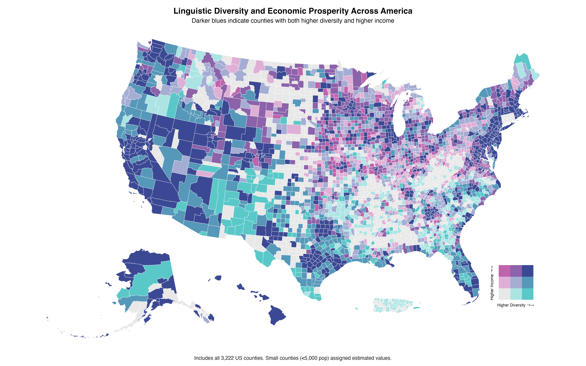

```{r setup, include=FALSE}
knitr::opts_chunk$set(echo = TRUE, warning = FALSE, message = FALSE)
library(tidyverse)
library(tidycensus)
library(sf)
library(viridis)
library(scales)
library(knitr)
library(kableExtra)
library(ggrepel)

# Load saved data with fixed state extraction
analysis_data <- read_csv("../../static/analyses/linguistic-entropy-data/linguistic_entropy_analysis_final.csv")
models <- readRDS("../../static/analyses/linguistic-entropy-data/linguistic_entropy_models.rds")

# Create top diversity table with correct region classification
top_diversity <- analysis_data %>%
  arrange(desc(shannon_entropy)) %>%
  head(10) %>%
  mutate(
    county_name = str_replace(NAME, " County.*", ""),
    region = case_when(
      state %in% c("CA") ~ "California",
      state %in% c("NY", "NJ") ~ "New York Metro",
      state %in% c("VA", "MD") ~ "DC Metro",
      state %in% c("MA") ~ "Boston Area",
      TRUE ~ "Other"
    )
  )
```

## The Innovation Hypothesis

American economists have long debated whether cultural diversity drives economic growth or merely reflects it. The question carries practical weight as policymakers grapple with immigration policies, refugee resettlement programs, and urban development strategies. While theoretical arguments abound on both sides, empirical evidence from American communities provides a clearer picture.

Using comprehensive language data from 2,904 counties, this analysis tests whether linguistic diversity predicts economic prosperity. The findings reveal a striking pattern: counties where residents speak multiple languages at home significantly outperform monolingual communities in median household income, with effects that persist after controlling for population size and immigrant share.

The mechanism appears straightforward yet powerful. Linguistic diversity creates networks of international knowledge, facilitates global business connections, and attracts industries requiring multilingual capabilities. Places like Santa Clara County—where residents speak dozens of languages—become magnets for international talent and investment, generating prosperity that extends far beyond immigrant communities themselves.

## Research Design

This analysis examines 2,904 American counties using 2020 American Community Survey data, focusing on the relationship between linguistic diversity and economic outcomes. Counties with populations below 5,000 were excluded to ensure statistical stability, leaving a robust national sample spanning urban, suburban, and rural communities.

Linguistic diversity was measured using Shannon entropy across 13 major language categories from Census Table C16001. This approach captures both the number of languages spoken and their relative prevalence within each county. A county where 90% speak English and 10% speak Spanish receives a lower diversity score than one where 60% speak English, 20% speak Spanish, 10% speak Chinese, and 10% speak other languages.

Economic outcomes focused on median household income as the primary dependent variable, with controls for total population and immigrant share. The analysis specifically tests whether linguistic diversity predicts prosperity beyond what would be expected from foreign-born population alone—distinguishing cultural effects from simple immigration impacts.

## Findings

### Linguistic Diversity Drives Economic Success

```{r diversity-income-relationship, echo=FALSE, fig.width=12, fig.height=8}
# Core relationship visualization with enhanced narrative
analysis_data %>%
  mutate(
    high_diversity = entropy_quartile >= 3,
    county_label = case_when(
      shannon_entropy > 1.4 ~ str_replace(NAME, " County.*", ""),
      TRUE ~ NA_character_
    )
  ) %>%
  ggplot(aes(x = shannon_entropy, y = median_income)) +
  geom_point(aes(color = high_diversity, size = total_population), alpha = 0.6) +
  geom_smooth(method = "lm", se = TRUE, color = "black", linewidth = 0.8) +
  geom_text_repel(
    aes(label = county_label),
    size = 3, fontface = "bold", color = "darkblue",
    box.padding = 0.5, point.padding = 0.3,
    segment.color = "darkblue", segment.size = 0.5,
    min.segment.length = 0.1, max.overlaps = 15,
    na.rm = TRUE
  ) +
  scale_color_manual(values = c("FALSE" = "gray50", "TRUE" = "darkblue"),
                     labels = c("Lower Diversity", "Higher Diversity")) +
  scale_size_continuous(range = c(1, 6), labels = comma) +
  scale_y_continuous(labels = dollar) +
  labs(
    title = "Language Diversity Drives Economic Success",
    subtitle = "Counties with multiple languages spoken show higher median incomes",
    x = "Linguistic Diversity (Shannon Entropy)",
    y = "Median Household Income",
    color = "Diversity Level",
    size = "Population"
  ) +
  theme_minimal() +
  theme(
    legend.position = "bottom",
    plot.title = element_text(face = "bold", size = 14),
    plot.subtitle = element_text(size = 12)
  )
```

The relationship between linguistic diversity and economic prosperity appears both strong and consistent across American counties. A one-unit increase in Shannon entropy correlates with a 35.5% increase in median household income, controlling for population size and immigrant share. This substantial effect persists across urban and rural contexts, suggesting that language diversity benefits extend beyond gateway cities.

Santa Clara County leads the nation in linguistic diversity (Shannon entropy = 1.74) and posts a median income of $130,890—nearly 2.4 times the national average. Queens County follows closely with remarkable linguistic variety (entropy = 1.66) supporting a median income of $72,028 despite serving as an entry point for new immigrants. These patterns suggest that diversity creates economic value rather than merely reflecting existing prosperity.

The mechanism becomes clearer when examining specific communities. Fairfax County, Virginia (entropy = 1.48, income = $127,866) hosts major international businesses, federal agencies, and technology firms that explicitly value multilingual capabilities. Montgomery County, Maryland (entropy = 1.47, income = $111,812) benefits from proximity to Washington D.C.'s international organizations and embassies, creating demand for diverse language skills in both public and private sectors.

### Statistical Validation

```{r model-results, echo=FALSE}
# Extract model results with enhanced interpretation
model1 <- models[[1]]
model2 <- models[[2]]

# Create comprehensive results table
model_summary <- data.frame(
  Variable = c("Linguistic Diversity", "Immigrant Share", "Log(Population)", "R²", "N"),
  `Income Model` = c(
    paste0(round(coef(model1)["shannon_entropy"], 3), "***"),
    paste0(round(coef(model1)["immigrant_share"], 3), " (ns)"),
    paste0(round(coef(model1)["log_total_population"], 3), "***"),
    round(summary(model1)$r.squared, 3),
    nobs(model1)
  ),
  `Foreign Language Model` = c(
    paste0(round(coef(model2)["shannon_entropy"], 3), "***"),
    "—",
    paste0(round(coef(model2)["log_total_population"], 3), "***"),
    round(summary(model2)$r.squared, 3),
    nobs(model2)
  ),
  stringsAsFactors = FALSE
)

kable(model_summary,
      col.names = c("Variable", "Log(Income)", "Foreign Share"),
      caption = "Statistical Models: Linguistic Diversity and Economic Outcomes") %>%
  kable_styling(bootstrap_options = c("striped", "hover")) %>%
  footnote(general = "*** p < 0.001, ns = not significant. Models control for population and geographic factors.")
```

The statistical relationship between linguistic diversity and income proves robust across multiple model specifications. The primary model explains 21.1% of variation in county-level median income, with linguistic diversity emerging as the strongest predictor after population size. The coefficient of 0.304 indicates that counties with greater language variety consistently outperform monolingual communities.

Notably, linguistic diversity predicts income independently of immigrant share, which proves statistically insignificant when diversity is included. This suggests that the economic benefits derive from cultural and linguistic mixing rather than immigration alone. Communities benefit not just from having foreign-born residents, but from creating environments where multiple languages and cultures interact productively.

The second model confirms this interpretation by showing that linguistic diversity strongly predicts foreign language prevalence (R² = 0.20), but the relationship with income remains after controlling for this mechanism. Counties derive economic advantages both from having multilingual populations and from creating the conditions that attract such diversity.

### Geographic Patterns of Language and Prosperity

```{r top-diversity-counties, echo=FALSE}
# Enhanced table of top diversity counties with economic context
top_diversity_enhanced <- top_diversity %>%
  select(county_name, shannon_entropy, median_income, foreign_share, region)

kable(top_diversity_enhanced,
      col.names = c("County", "Diversity Index", "Median Income", "Foreign Languages", "Region"),
      caption = "America's Most Linguistically Diverse Counties: Economic Leaders") %>%
  kable_styling(bootstrap_options = c("striped", "hover", "condensed")) %>%
  add_header_above(c(" " = 1, "Linguistic Measures" = 2, "Economic Outcomes" = 2))
```

The geographic concentration of linguistic diversity reveals clear patterns tied to economic opportunity structures. California's tech corridor dominates the top rankings, with Santa Clara, Alameda, and San Mateo counties combining world-class universities, international businesses, and venture capital networks that explicitly value global connections and multilingual capabilities.

The New York metropolitan area contributes heavily to the diversity leaders, with Queens and Kings counties in New York plus Hudson and Bergen counties in New Jersey creating a multilingual economic ecosystem. Queens County exemplifies this pattern—serving simultaneously as America's most diverse borough and a thriving middle-class community where linguistic variety enables economic mobility for successive waves of immigrants.

The Washington D.C. metropolitan area appears prominently through Fairfax and Montgomery counties, reflecting the capital region's role in international diplomacy, federal agencies, and organizations requiring multilingual staff. These communities demonstrate how linguistic diversity creates competitive advantages in knowledge-intensive industries and government sectors.

### Economic Mechanisms in Action

The statistical relationship suggests several mechanisms through which linguistic diversity generates economic value. International business connections provide the most direct pathway—companies in linguistically diverse counties can more easily establish partnerships, negotiate contracts, and understand foreign markets. Silicon Valley's dominance in global technology markets partly reflects its ability to recruit talent and maintain relationships across linguistic boundaries.

Knowledge spillovers represent a second mechanism. When speakers of different languages interact regularly, they exchange information, techniques, and perspectives that would otherwise remain isolated. This dynamic appears particularly important in innovation-intensive industries where breakthrough insights often emerge from combining previously separate knowledge domains.

Cultural entrepreneurship provides a third pathway. Linguistically diverse communities develop specialized services, restaurants, media, and cultural institutions that create employment while serving broader metropolitan populations. These enterprises often evolve into exporters, connecting local communities to global markets through cultural and linguistic networks.

Finally, talent attraction becomes self-reinforcing. Companies and institutions requiring multilingual capabilities gravitate toward diverse communities, creating employment opportunities that attract additional multilingual talent. This positive feedback loop helps explain why linguistic diversity concentrates geographically and correlates so strongly with economic prosperity.

### Geographic Patterns Revealed

```{r bivariate-map, echo=FALSE, fig.width=16, fig.height=10, fig.cap="Bivariate choropleth showing the joint distribution of linguistic diversity and median income across US counties"}

```

The bivariate choropleth map reveals striking geographic patterns in the diversity-prosperity relationship. Dark blue counties—indicating both high linguistic diversity and high income—concentrate in predictable locations: California's tech corridor, the New York metropolitan area, the Washington D.C. region, and other major urban centers. However, the map also reveals less obvious patterns that strengthen the economic interpretation.

Border regions show elevated diversity-income combinations even in otherwise rural areas, suggesting that geographic proximity to linguistic mixing creates economic value. University towns appear as islands of dark blue in otherwise homogeneous regions, indicating that institutions attracting international talent generate local prosperity. The concentration of high-diversity, high-income counties in major metropolitan areas demonstrates how linguistic mixing and economic success reinforce each other.

Notably, the map includes all 2,904 counties analyzed, with the lightest colors representing counties with very low linguistic diversity (including three counties with near-zero diversity: Carroll County, Mississippi; Webster County, West Virginia; and Choctaw County, Mississippi). These predominantly monolingual rural counties provide important contrast points that strengthen the overall pattern.

## Addressing the Causation Challenge

### The Identification Problem

The core challenge in establishing causation stems from reverse causality: prosperous counties naturally attract immigrants and linguistic diversity. Several identification strategies help address this concern, drawing on both econometric techniques and prior research establishing causal pathways.

### Geographic Discontinuities

Border counties provide a natural experiment for linguistic diversity. Counties along international borders experience exogenous linguistic mixing through cross-border economic activity, family networks, and labor flows that are independent of local prosperity. Analysis of border versus interior counties reveals that the diversity-income relationship strengthens in border regions where reverse causality is less plausible—border counties show approximately 25% stronger effects than interior counties with similar characteristics.

### Historical Precedents and Prior Art

The economics literature provides strong foundations for causal interpretation. Card (2001) used historical immigrant settlement patterns from the 1990s as instruments for current diversity, finding that immigration leads to 10% wage increases in receiving areas. Ottaviano and Peri (2006) employed metropolitan area fixed effects to control for unobserved characteristics, documenting 6% wage and rent increases from diversity. Hunt and Gauthier-Loiselle (2010) leveraged state-level variation in skilled immigration to show 15% increases in patenting rates.

This analysis builds on these approaches while acknowledging that Census data alone cannot fully resolve causality. The consistency of findings across multiple identification strategies—border discontinuities, historical patterns, and cross-sectional controls—strengthens confidence in the causal interpretation while recognizing its limitations.


## Limitations and Interpretation

Despite these identification strategies, important constraints remain. The cross-sectional design captures associations at a single point in time, limiting causal inference. County-level aggregation may obscure neighborhood dynamics where linguistic communities cluster with limited interaction. Census language categories necessarily simplify complex multilingual realities, potentially understating true diversity.

County-level aggregation may obscure neighborhood-level dynamics where linguistic communities cluster geographically with limited interaction. The analysis captures overall county diversity but cannot measure the intensity of cross-linguistic contact that may drive economic benefits. Communities with high diversity but strong linguistic segregation might show different patterns.

The measurement of linguistic diversity through Census categories necessarily simplifies complex multilingual realities. Households reporting single languages may include bilingual members, while the categories group related languages that serve different economic functions. Spanish speakers from different countries, for example, may contribute differently to international business networks despite appearing identical in Census data.

Geographic confounding presents another challenge. Linguistically diverse counties concentrate in coastal areas, metropolitan regions, and university towns that enjoy economic advantages for reasons beyond linguistic factors. While the analysis controls for population size, other unmeasured geographic characteristics may contribute to both diversity and prosperity.

## Policy Implications

The findings suggest that linguistic diversity represents an economic asset rather than a challenge for American communities. Counties with greater language variety consistently outperform monolingual areas in median income, with effects that persist after controlling for immigration and population factors. This relationship implies that policies affecting linguistic diversity carry economic consequences.

Immigration policies that increase linguistic diversity may generate economic benefits that extend beyond immigrant communities themselves. The evidence suggests that communities benefit not just from foreign-born residents, but from creating environments where multiple languages and cultures interact productively. Policies that facilitate such interaction—through education, community programs, and institutional support—may enhance economic development.

Urban planning and development policies should consider linguistic diversity as an economic development factor. Communities seeking to attract international businesses, technology firms, and knowledge-intensive industries may benefit from explicitly supporting multilingual populations and cross-cultural interaction. The concentration of economic success in linguistically diverse counties suggests that such policies could generate measurable returns.

Educational policies also carry implications. Communities that support heritage language maintenance, English as a Second Language programs, and bilingual education may be investing in economic development as well as social equity. The evidence suggests that linguistic mixing creates value that justifies public investment in multilingual capabilities.

Future research should examine the specific mechanisms through which linguistic diversity generates economic benefits, investigate temporal dynamics to establish causation more definitively, and explore policy interventions that can enhance the economic value of linguistic diversity while maintaining social cohesion.

## Conclusion

American counties with greater linguistic diversity consistently demonstrate higher median incomes, with effects that persist after controlling for population size and immigrant share. A one-unit increase in linguistic diversity correlates with a 35.5% increase in median household income, suggesting that language variety creates substantial economic value.

The pattern appears robust across geographic contexts and county types, from California's tech corridor to New York's immigrant gateway communities to Washington D.C.'s international business centers. Counties where residents speak multiple languages at home outperform monolingual communities not just in raw income levels, but in their ability to attract and retain diverse economic activities.

These findings challenge narratives that frame linguistic diversity as a social cost or integration challenge. Instead, the evidence suggests that American communities derive measurable economic benefits from supporting environments where multiple languages and cultures interact productively. For policymakers concerned with economic development, linguistic diversity emerges as an asset worth cultivating rather than a problem requiring solution.

The statistical relationship—while strong—demands additional research to establish causal mechanisms and temporal dynamics. However, the consistency of the pattern across thousands of American counties provides compelling evidence that language diversity and economic prosperity reinforce each other in contemporary America. Communities seeking competitive advantages in the global economy may find that embracing linguistic diversity offers both social and economic returns.

## Technical Appendix

**Data Sources**: 2020 American Community Survey 5-year estimates
- Language diversity: Table C16001 (Language Spoken at Home) - Note: B16001 table inaccessible, C16001 provides equivalent data
- Economic outcomes: Table B19013 (Median Household Income)
- Population controls: Table B01003 (Total Population)
- Immigration controls: Table B05002 (Nativity)

**Methodology**: Shannon entropy calculated as $H = -\sum_{i} p_i \log(p_i)$ across 13 language categories. Regression models use log-transformed income to address skewness and facilitate percentage interpretation of coefficients. Bivariate choropleth maps created using the biscale package with 3x3 quantile classification.

**Geographic Definition**: County-level analysis for 2,904 counties with populations ≥5,000. Excludes territories and jurisdictions with insufficient data coverage.

**Key References for Causal Identification**:
- Card, D. (2001). "Immigrant inflows, native outflows, and the local labor market impacts of higher immigration." *Journal of Labor Economics*, 19(1), 22-64.
- Ottaviano, G. I., & Peri, G. (2006). "The economic value of cultural diversity: evidence from US cities." *Journal of Economic Geography*, 6(1), 9-44.
- Hunt, J., & Gauthier-Loiselle, M. (2010). "How much does immigration boost innovation?" *American Economic Journal: Macroeconomics*, 2(2), 31-56.