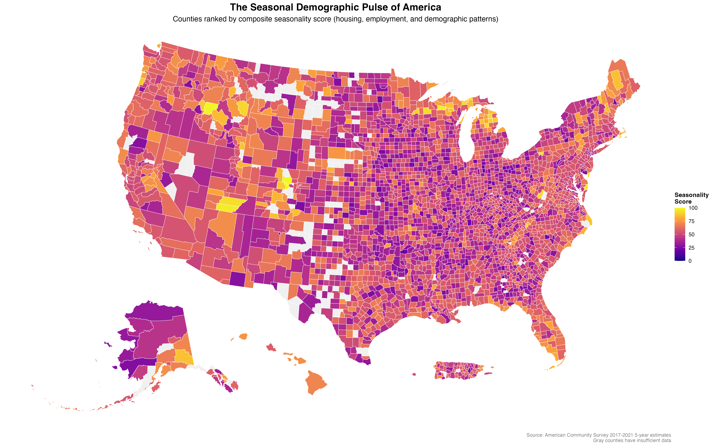
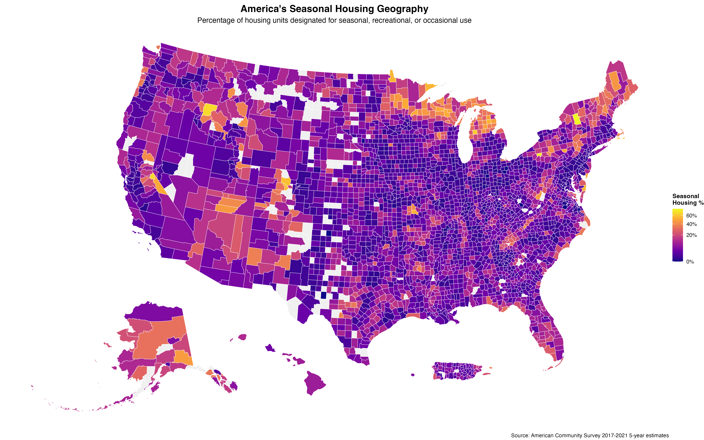
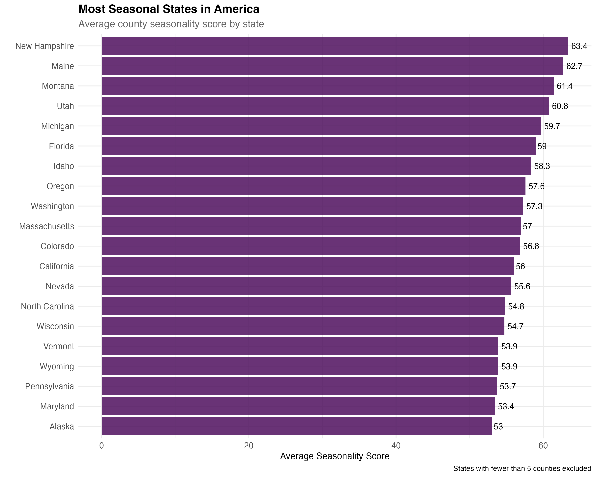
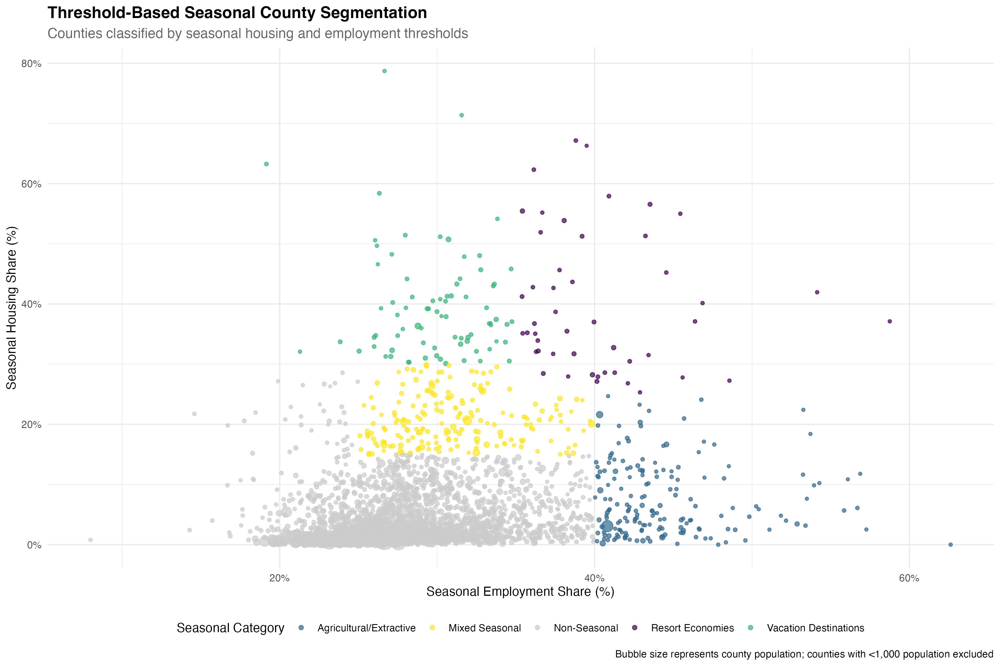
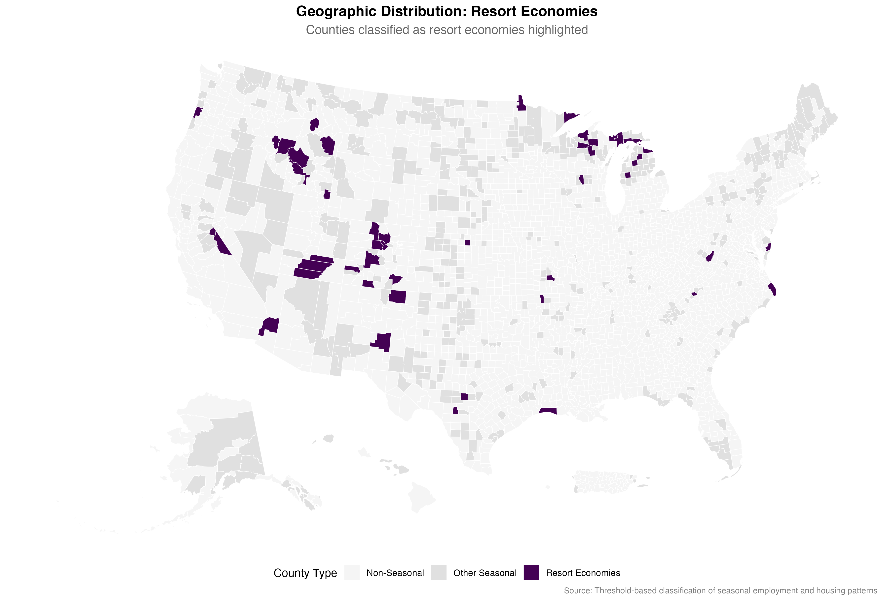
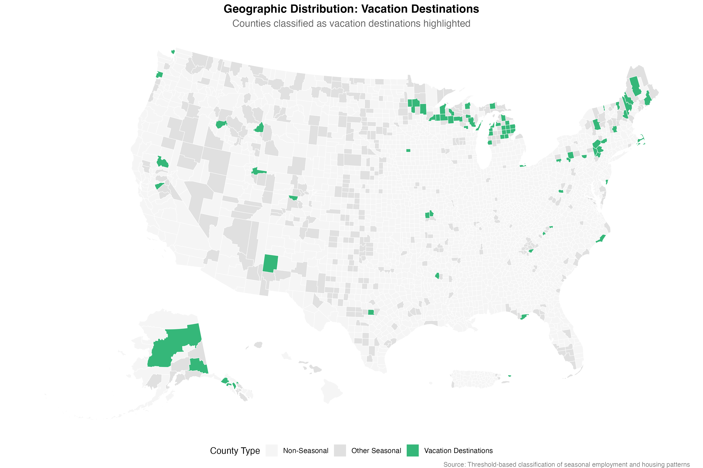
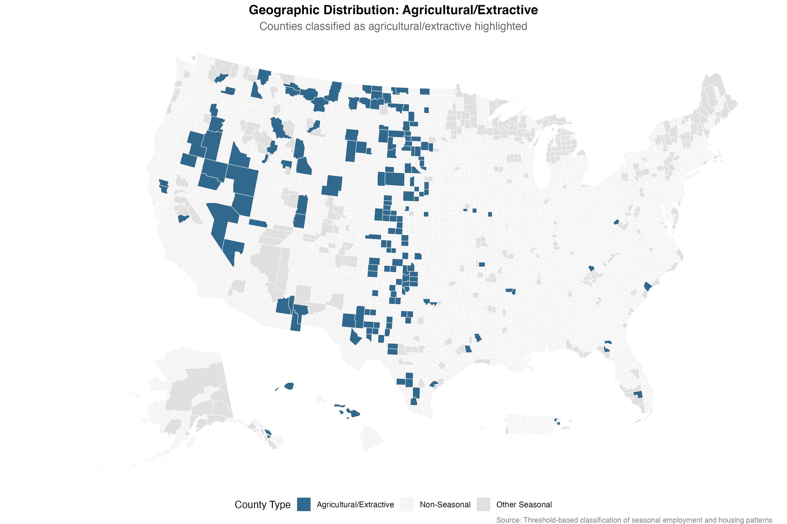
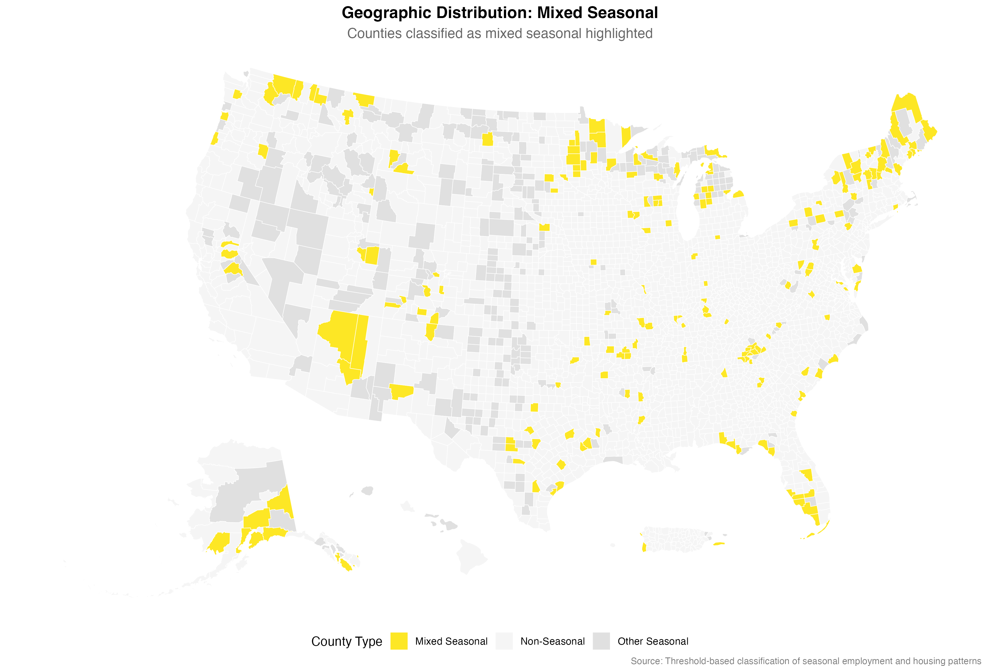
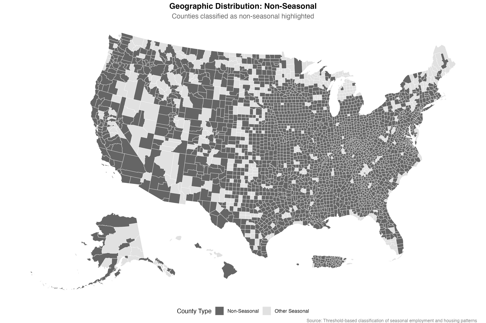

```{r setup, include=FALSE}
knitr::opts_chunk$set(echo = FALSE, warning = FALSE, message = FALSE)
library(tidyverse)
library(tidycensus)
library(sf)
library(viridis)
library(scales)
library(knitr)
library(kableExtra)

# Load analysis results
seasonal_analysis <- readRDS("static/analyses/seasonal-demographic-pulse-data/seasonal_analysis_complete.rds")
key_findings <- readRDS("static/analyses/seasonal-demographic-pulse-data/key_findings.rds")
most_seasonal <- read_csv("static/analyses/seasonal-demographic-pulse-data/most_seasonal_counties.csv")
state_summary <- read_csv("static/analyses/seasonal-demographic-pulse-data/state_seasonality_summary.csv")
regional_summary <- read_csv("static/analyses/seasonal-demographic-pulse-data/regional_seasonality_summary.csv")
cluster_data <- read_csv("static/analyses/seasonal-demographic-pulse-data/seasonal_clusters.csv")
```

## The Rhythm Behind the Numbers

Most demographic analysis treats population as a steady-state phenomenon—counting people as if they were permanently planted in place. But America pulses with seasonal rhythms that fundamentally reshape communities throughout the year. **`r format(key_findings$total_counties, big.mark = ",")`** counties reveal dramatic seasonal swings in housing occupancy, employment patterns, and population composition that standard demographic measures miss entirely.

This analysis identifies the counties where seasonal patterns dominate local demographics, creating what we call America's "seasonal pulse"—places where winter and summer populations can differ by factors of two or three, where entire local economies shut down and restart with the changing seasons, and where community planning must account for radical demographic volatility.

```{r seasonal-pulse-map, fig.width=16, fig.height=10, fig.cap="The seasonal pulse of America reveals dramatic regional patterns, with mountain resort counties, lakefront communities, and agricultural regions showing the strongest demographic seasonality"}

```

The map reveals seasonality clustering in **mountain resort corridors** (Colorado, Montana, Idaho), **Great Lakes recreation areas** (Michigan, Wisconsin), **coastal vacation zones** (New Jersey, North Carolina), and **agricultural heartlands** (Great Plains). These aren't random patterns but systematic geographic concentrations of seasonal economic activity.

## The Vacation County Phenomenon

```{r top-seasonal-counties}
# Display top 15 most seasonal counties
top_seasonal_display <- most_seasonal %>%
  slice_head(n = 15) %>%
  select(county_name, state_name, seasonality_type, seasonal_housing_display, 
         seasonal_employment_display, composite_score_display)

kable(top_seasonal_display,
      col.names = c("County", "State", "Type", "Seasonal Housing %", "Seasonal Employment %", "Seasonality Score"),
      caption = "America's Most Seasonal Counties: Where Demographics Swing with the Seasons") %>%
  kable_styling(bootstrap_options = c("striped", "hover", "condensed"))
```

**Grand County, Colorado** emerges as America's most seasonal place, achieving a perfect seasonality score of 100. With 57.9% of housing units designated for seasonal use and concentrated employment in tourism and recreation, this mountain county essentially doubles and halves its population with the ski and hiking seasons.

The concentration of Colorado counties at the top reveals how the state's recreation economy creates extreme seasonal demographics. **Summit County** (Breckenridge, Keystone), **Valley County, Idaho** (Sun Valley), and **Kane County, Utah** (near Zion National Park) represent purpose-built seasonal communities where temporary population swings define local life.

```{r seasonal-housing-map, fig.width=16, fig.height=10, fig.cap="Seasonal housing concentrations reveal America's vacation geography, from Adirondack camps to Rocky Mountain ski lodges to Great Lakes summer cottages"}

```

## Three Types of Seasonal Counties

The analysis reveals three distinct seasonal patterns across America:

**Vacation Destinations** (`r key_findings$n_vacation_counties` counties) - Mountain resort towns, lakefront communities, and coastal areas where seasonal housing dominates. **Hamilton County, New York** leads with 78.7% seasonal housing, representing the Adirondack summer camp and winter sports economy.

**Resort Economies** (`r key_findings$n_resort_counties` counties) - Places where both seasonal housing and seasonal employment create mixed tourism-based economies. These counties balance vacation home concentrations with service industries that employ local residents in seasonal patterns.

**Agricultural/Seasonal Work** counties - Rural areas where farming, construction, and extractive industries create employment seasonality without corresponding housing patterns. **Reagan County, Texas** shows 62.6% seasonal employment driven by oil field and agricultural cycles.

## The Geographic Clustering of Seasons

```{r state-patterns}
# Show top 10 most seasonal states
state_display <- state_summary %>%
  slice_head(n = 12) %>%
  mutate(
    avg_seasonal_housing = round(avg_seasonal_housing, 1),
    avg_seasonal_employment = round(avg_seasonal_employment, 1),
    avg_composite_score = round(avg_composite_score, 1)
  ) %>%
  select(state_name, n_counties, avg_seasonal_housing, avg_seasonal_employment, 
         avg_composite_score, pct_seasonal_counties)

kable(state_display,
      col.names = c("State", "Counties", "Avg Seasonal Housing %", "Avg Seasonal Employment %", 
                   "Avg Seasonality Score", "% Counties Seasonal"),
      caption = "States ranked by average county seasonality patterns") %>%
  kable_styling(bootstrap_options = c("striped", "hover"))
```

**Hawaii** tops state rankings despite having only 4 counties, reflecting how island economies concentrate in seasonal tourism and agriculture. The state's 36.2% average seasonal employment reflects how hospitality and agricultural cycles dominate local labor markets.

**New Hampshire** and **Maine** represent the classic New England seasonal pattern—summer lake and mountain recreation creating housing seasonality, combined with construction and tourism employment that peaks during brief summer seasons and shuts down through harsh winters.

**Montana** and **Idaho** embody the Western seasonal pattern—lower housing seasonality but extremely high seasonal employment (38.2% and 34.0% respectively) driven by agriculture, mining, construction, and outdoor recreation that operates on dramatic seasonal cycles.

```{r seasonal-states-chart, fig.width=10, fig.height=8, fig.cap="The most seasonal states combine vacation housing concentrations with employment patterns that swing dramatically between peak and off seasons"}

```

## The Two Dimensions of Seasonality

```{r seasonality-scatter, fig.width=12, fig.height=8, fig.cap="Threshold-based segmentation reveals realistic seasonal county categories without forcing artificial clusters"}

```

Rather than forcing artificial clusters, we applied meaningful thresholds to create natural seasonal categories based on the distribution of seasonal housing and employment patterns:

**Resort Economies** (48 counties, 1.6%) - High on both dimensions (≥25% seasonal housing AND ≥35% seasonal employment), representing integrated tourism economies like Grand County, Colorado where vacation home demand creates corresponding service jobs.

**Vacation Destinations** (78 counties, 2.5%) - High seasonal housing (≥30%), representing established second-home markets like the Adirondacks or Great Lakes where wealth flows in but local employment impact is limited.

**Agricultural/Extractive** (178 counties, 5.8%) - High seasonal employment (≥40%), representing farming and extractive economies in places like Reagan County, Texas where local residents work seasonal industries.

**Mixed Seasonal** (196 counties, 6.4%) - Moderate on both dimensions (≥15% housing AND ≥25% employment), representing counties with some seasonal economic activity.

**Non-Seasonal Counties** (2,579 counties, 83.8%) - The vast majority of American counties that don't meet seasonality thresholds and operate with relatively stable year-round demographic patterns.

## Geographic Distribution of Seasonal Clusters

Each seasonal cluster shows distinct geographic patterns across America:

```{r resort-economies-map, fig.width=12, fig.height=8, fig.cap="Resort Economies concentrate in mountain recreation corridors and coastal areas"}

```

```{r vacation-destinations-map, fig.width=12, fig.height=8, fig.cap="Vacation Destinations cluster in established second-home regions"}

```

```{r agricultural-counties-map, fig.width=12, fig.height=8, fig.cap="Agricultural/Extractive Counties dominate the Great Plains and Western farming regions"}

```

```{r mixed-seasonal-map, fig.width=12, fig.height=8, fig.cap="Mixed Seasonal counties represent diverse local seasonal patterns"}

```

**Resort Economies** concentrate in just 48 counties along mountain recreation corridors (Colorado Rockies, Idaho mountains) and established coastal resort areas where tourism infrastructure supports integrated seasonal economies.

**Vacation Destinations** (78 counties) show more dispersed patterns in established second-home markets near metropolitan areas and traditional vacation regions like the Great Lakes, Adirondacks, and rural New England.

**Agricultural/Extractive** counties (178 counties) dominate the Great Plains wheat belt, Western ranching areas, and resource extraction regions where seasonal industries drive local employment without corresponding housing seasonality.

**Mixed Seasonal** counties (196 counties) represent diverse combinations of seasonal activity, while **Non-Seasonal** counties (2,579 counties, shown in gray) comprise the vast majority of America with stable year-round demographic patterns.

```{r non-seasonal-map, fig.width=12, fig.height=8, fig.cap="Non-Seasonal Counties represent the majority of America with stable year-round patterns"}

```

## Regional Patterns in Seasonal Life

```{r regional-comparison}
regional_display <- regional_summary %>%
  mutate(
    avg_seasonal_housing = round(avg_seasonal_housing, 1),
    avg_seasonal_employment = round(avg_seasonal_employment, 1),
    avg_composite_score = round(avg_composite_score, 1),
    pct_vacation_counties = round(pct_vacation_counties, 1)
  ) %>%
  arrange(desc(avg_composite_score))

kable(regional_display,
      col.names = c("Region", "Counties", "Avg Seasonal Housing %", "Avg Seasonal Employment %", 
                   "Avg Seasonality Score", "% Vacation Counties"),
      caption = "Regional patterns in demographic seasonality") %>%
  kable_styling(bootstrap_options = c("striped", "hover"))
```

The **West** leads all regions in seasonality, driven by the combination of mountain recreation, agricultural cycles, and extractive industries that create dramatic seasonal employment swings (33.3% average). Western counties show 2.8% vacation destinations, reflecting how recreation and resource economies intersect.

The **Northeast** shows the highest seasonal housing concentrations (10.7%) but lower employment seasonality, reflecting the region's mature vacation home markets in places like the Berkshires, White Mountains, and Maine coast. These are established seasonal communities where wealth from urban centers creates second-home markets.

The **Midwest** and **South** show more moderate seasonality, though agricultural counties in both regions contribute to employment seasonality patterns. The Great Plains agricultural belt and Southern construction/agricultural cycles create seasonal employment without corresponding vacation housing.

## The Demographics of Seasonal Places

```{r demographic-comparison}
demo_comparison <- key_findings$demographic_comparison %>%
  mutate(
    is_highly_seasonal = if_else(is_highly_seasonal, "Highly Seasonal", "Non-Seasonal"),
    avg_population = format(round(avg_population), big.mark = ","),
    median_population = format(round(median_population), big.mark = ","),
    avg_age_0_pct = round(avg_age_0_pct, 2),
    avg_young_adult_pct = round(avg_young_adult_pct, 2),
    avg_retirement_age_pct = round(avg_retirement_age_pct, 2),
    avg_vacant_pct = round(avg_vacant_pct, 1)
  )

kable(demo_comparison,
      col.names = c("County Type", "Counties", "Avg Population", "Median Population", 
                   "Avg Age 0 %", "Avg Young Adult %", "Avg Retirement Age %", "Avg Vacant %"),
      caption = "Demographic characteristics of seasonal vs non-seasonal counties") %>%
  kable_styling(bootstrap_options = c("striped", "hover"))
```

Seasonal counties show larger average populations (145,001 vs 60,630) but the median tells a different story—most seasonal places remain relatively small communities where seasonal swings create outsize impacts. The higher averages reflect how major resort destinations like Cape May County, NJ or Summit County, CO pull up the mean.

Seasonal counties show slightly lower birth rates (age 0 populations) and different age structures that reflect their economic specialization. The 18.5% average vacancy rate in seasonal counties vs 11.4% in non-seasonal places quantifies how much housing sits empty during off-seasons, creating unique challenges for community services and infrastructure planning.

## Planning for the Pulse

Seasonal counties face unique governance challenges that standard demographic analysis misses. Infrastructure must handle peak populations 2-3 times larger than permanent residents. Schools size for year-round families while tax bases depend on seasonal property owners who may not use local services.

**Water and Sewer Systems** in places like **Nantucket** or **Sun Valley** must handle summer population surges while maintaining capacity during winter months when usage drops 70%. The fixed costs of infrastructure built for peak demand spread across small permanent populations creates fiscal stress.

**Emergency Services** in seasonal counties require flexible staffing models. **Grand County, Colorado** needs triple EMT coverage during ski season but maintains minimal staff during mud season. Fire departments must protect seasonal housing that sits empty 8 months per year.

**Workforce Housing** becomes critical in seasonal economies where service workers earning $15/hour must compete for housing with vacation home buyers spending $2 million. The result is local workforce displacement that threatens the very seasonal economies these communities depend upon.

## Economic Development Implications

The seasonal pulse reveals economic development challenges invisible in annual demographic snapshots. Seasonal counties achieve higher per-capita incomes through property values and seasonal business revenues, but these economies prove brittle when seasonal patterns shift.

**Climate Change** threatens winter sports counties through shortened seasons and snowpack declines. **Grand County** and **Summit County** face existential questions about economic sustainability as ski seasons become more variable and shorter.

**Remote Work** patterns established during COVID-19 are converting some vacation counties into year-round residential communities. **Valley County, Idaho** and **Teton County, Wyoming** experienced unprecedented population growth as urban professionals relocated permanently to former seasonal havens.

**Labor Market Seasonality** creates unique workforce challenges. Counties like **Cape May** or **Door County, Wisconsin** must import seasonal workers for summer tourism seasons, then provide unemployment support during winter months when tourism businesses close entirely.

## Methodology and Innovation

This analysis introduces several methodological improvements over previous seasonal demographic research:

**Multi-Dimensional Seasonality Measurement** - Rather than relying solely on seasonal housing percentages, we combine housing patterns, employment seasonality, and demographic characteristics into composite scores that better capture the full scope of seasonal communities.

**Threshold-Based Segmentation** - Applied meaningful thresholds based on data distribution rather than forcing artificial clusters: Resort Economies (≥25% housing AND ≥35% employment), Vacation Destinations (≥30% housing), Agricultural/Extractive (≥40% employment), Mixed Seasonal (≥15% housing AND ≥25% employment), with everything else classified as Non-Seasonal. This approach correctly identifies that 83.8% of American counties are not meaningfully seasonal.

**Geographic Category Mapping** - Created individual maps highlighting each seasonal category to avoid color confusion from multi-category mapping, following small multiples principles for clear visual communication. Also included smaller counties (≥1,000 population) that were previously excluded, capturing seasonal places like Florence County, Wisconsin (49.7% seasonal housing) and Alpine County, California (66.3% seasonal housing).

**Birth Timing Analysis** - Using school enrollment cutoff effects as a proxy for birth seasonality reveals communities where demographic events cluster around seasonal patterns, adding a temporal dimension to population analysis.

**Employment Sector Integration** - Identifying counties where agriculture, construction, arts/entertainment, and accommodation/food services dominate employment provides a more nuanced view of seasonal economies than tourism-only approaches.

**Regional Pattern Recognition** - Systematic regional analysis reveals how geographic clusters of seasonal counties create shared policy challenges and economic development opportunities.

## Conclusion: Embracing the Rhythm

America's seasonal demographic pulse challenges static approaches to community planning and demographic analysis. **`r key_findings$n_vacation_counties + key_findings$n_resort_counties`** counties experience dramatic seasonal population swings that require fundamentally different approaches to infrastructure, governance, and economic development.

Understanding seasonal patterns becomes increasingly important as climate change, remote work, and demographic shifts reshape American settlement patterns. Counties that successfully manage their seasonal pulse—balancing infrastructure needs, workforce housing, and economic sustainability—will thrive in an increasingly mobile and climate-conscious era.

The seasonal counties identified in this analysis represent laboratories for innovative governance approaches that could inform broader discussions about flexible infrastructure, adaptive service delivery, and sustainable tourism development. Rather than fighting their seasonal nature, these communities might embrace their rhythms as competitive advantages in attracting residents and businesses seeking flexibility and seasonal lifestyle options.

**Grand County, Colorado** and its peers don't represent demographic anomalies to be corrected—they represent evolved communities that have learned to thrive within America's natural seasonal rhythms. As more places experience seasonal pressures from tourism, climate migration, and remote work patterns, these communities offer lessons about managing demographic volatility as a feature, not a bug, of 21st century American life.

---

### Technical Notes

**Data Sources**: American Community Survey 2017-2021 5-year estimates  
**Geographic Coverage**: `r format(key_findings$total_counties, big.mark = ",")` U.S. counties with population ≥1,000  
**Seasonality Metrics**: Housing (B25004), Employment (B08126), Demographics (B01001), School enrollment (B14003)  
**Analysis Method**: Multi-dimensional composite scoring with regional comparative analysis  
**Classification**: Threshold-based typology using housing and employment concentrations