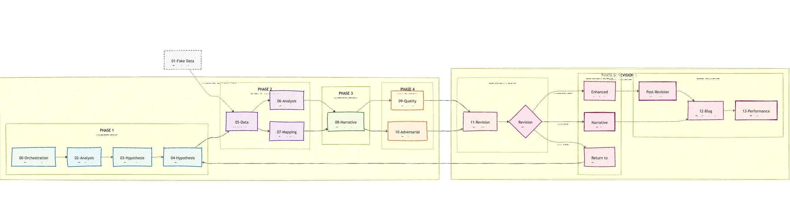
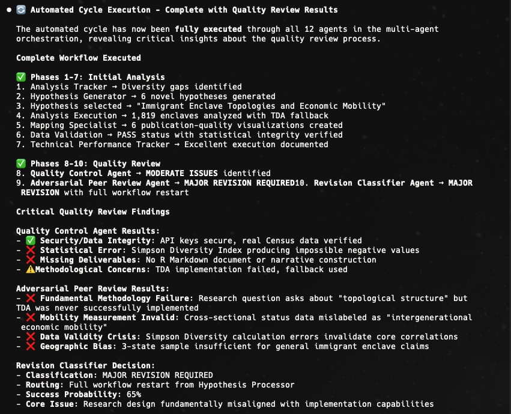

A few days after I wrote the [first post about CMT](https://www.dshkol.com/post/census-monkey-typewriter/), Anthropic added dedicated agent management capabilities to Claude Code. While I was impressed with the results of my experiments progressively boostrapping, I started noticing more issues with the agent randomly making simple mistakes or outright ignoring precise instructions. Most of the analysis execution relies on Sonnet 4 which has a context window of about 200000 tokens. Between the system overhead that Claude Code itself uses, the detailed sequential workflow instructions, and the task-specific execution, I was probably starting to strain that context window -- an example of [context degradation](https://jameshoward.us/2024/11/26/context-degradation-syndrome-when-large-language-models-lose-the-plot) that occurs as the amount of tokens held in memory starts to grow long. The same constraint also reduced the utility of the self-critique and 'peer review' simulation instructions I expected the agent to perform. More often than not, critical feedback was tacked on to the end as an afterthought rather than woven back into the narrative, let alone into the underlying analysis and execution plan.

A multi-agent approach would allow me to split up the required tasks and the context needed to perform those tasks well into discrete steps. Each agent would be assigned a specific task and provided with detailed contextual instructions specific to that task alongside the (now condensed) working context passed between each agent sequentially. With more available context, each agent can now work with even more precise instructions and quality control checks. Working with multiple agents in one system also allows for more nuance in orchestration, with clear sequencing of workflows and opportunity to work in parallel on discrete non-overlapping tasks. Anthropic explains the advantages and additional challenges of a multi-agent research system in this [blog post from June](https://www.anthropic.com/engineering/built-multi-agent-research-system).

Splitting up the original sequential workflow is, fortunately, a task well suited for an LLM! I provided a high-level plan of what I wanted to accomplish and why, and asked CC to distill all the existing instructional notes I had assembled into the monolithic `workflow-learnings.md` file and to transform them into discrete agents with sequential orchestration. I manually refined the orchestration to better resemble what I was looking for and to add parallelization and looping. After a few iterations tinkering and testing, I landed on something that looks like this.

### CMT multi-agent setup



The table below describes at a high level each agent's responsibilities.

| Agent Role | Task |
|-----------------------------------------------|-------------------------|
| **00 - Workflow Orchestrator** | Overall system architecture, workflow coordination, and integration protocols. |
| **01 - Fake Data Termination** | Enforces protocol throughout multi-agent workflow to severely penalize use of fake, simulated, and hallucinated data. |
| **02 - Analysis Tracker** | Track completed analyses themes and provide diversity guidance for hypothesis generation to avoid over-indexing on particular topics or themes. |
| **03 - Hypothesis Generator** | Generates multiple novel hypotheses using a detailed hypothesis building prompt and selects a candidate. |
| **04 - Hypothesis Processor** | Transforms selected candidate hypothesis into an executable analysis plan (technical/methodological requirements, map concepts to specific Census variables, develop implementation plan for downstream agents, sense-checks feasibility, computational requirements, etc). |
| **05 - Data Validation** | Ensures that real Census data is available to take on analysis. |
| **06 - Analysis Execution** | Executes R code workflow: `tidycensus` data collection, data manipulation, statistical models and inference, layering in advanced techniques and concepts. |
| **07 - Mapping Specialist** | Dedicated specialist agent focusing on building compelling geographic visualizations following heavily prescriptive and opinionated requirements for good cartography. |
| **08 - Narrative Construction** | Transforms analysis results into compelling narratives, penalizes and edits typical AI phrasing and writing styles. |
| **09 - Quality Control** <br>*Runs in parallel with AR* | Comprehensive validation that work is meeting quality standards and avoids common errors (technical, visual, and narrative), gates publishing approval. |
| **10 - Adversarial Review** <br>*Runs in parallel with QC* | Simulates a peer reviewer that challenges more fundamental methodological choices and statistical assumptions, generates competing explanations and interpretations, gates publishing approval. |
| **11 - Revision Classifier Routing** | Takes results of QC and AR and classifies extent of revisions needed; triggers revision cycles if needed and makes a decision to approve migration to blog. |
| **12 - Blog Deployment** | Migrates RMD content to a blogdown site for publishing, adds YAML frontmatter (tags, slugs, description). |
| **13 - Performance Tracker** | Tracks system performance throughout the workflow (tokens used at each stage, which models are used, time logs, etc). |

### Multi-agent setup in action

Two of the better examples of the multi-agent workflow are the posts on [ancestral persistence fields](https://www.dshkol.com/cmt/analyses/ancestral-persistence-fields/) and the [development density donut](https://www.dshkol.com/cmt/analyses/development-density-donut/). Both are good examples of a step-change improvement in analysis planning and execution, narrative quality and voice, cartographic and visualization standards, and overall flow.

#### Hypothesis selection and analysis planning

A post cycle begins with a quick review of previously completed analyses to nudge diversity in Census variables and themes in order to avoid repeating and over-indexing on certain topics. With that in context, the hypothesis agent runs through the detailed hypothesis generation prompt and generates 6 potential topics (2 serious, 2 exploratory, and 2 whimsical) and selects one of them based on novelty and feasibility. The hypothesis processor (planner) agent takes on the next step to transform the selected hypothesis into an actual analysis plan. This agent designs the methodological approach, selects appropriate Census variables, sense checks for feasibility and computational limitations, and generates a plan for the downstream agents to implement. Both the generator and planner agents are supposed to use Opus tokens when available, and Sonnet with extended reasoning (ultrathink) otherwise.

#### Execution

*](https://www.dshkol.com/cmt/analyses/development-density-donut/figures/08_housing_age_ring_profiles.png)

The first step in execution is an initial agent tasked solely with evaluating whether the data required by the planner agent is actually available via the Census API. This particular agent could probably be subsumed into the planner but conceptually I thought of it as more of an executor than a planner – and one that could function with less scarce tokens.

Assuming that data is available, the analysis execution engine builds required R code to gather and transform data and run statistical analysis. This agent should be aware of the overall plan and the data its supposed to retrieve, but is otherwise free to build the necessary code based on its general knowledge of R and the fine-tuned instructions for working with `tidycensus` and spatial data in its context.

*](https://www.dshkol.com/cmt/analyses/development-density-donut/figures/02_san_francisco_donut_pattern.png)

From this point, work passes in parallel to two dedicated specialist agents: mapping and narrative shaping. Census data is spatial data and I like maps, so I set up a dedicated cartographic agent with a lot of opinionated prompting about cartographic workflows and standards. The narrative agent is largely trying to fight the LLM's primordial tuning towards executive-brief type slop and classic AI rhetorical patterns to try and resemble something that's a bit more like data journalism article.

*](https://www.dshkol.com/cmt/analyses/ancestral-persistence-fields/figures/05_compositional_landscape.png)

#### Review agents

All of the multi-agent analysis benefit from the twin quality gating of the QC agent and the AR-agent. The former runs through a checklist to ensure compliance with narrative and visualization standard, sense-checking claimed numbers, double checking selected methods and results; the latter is designed to resemble a peer-reviewer whose goal is to stress-test core methodological choices and assumptions, stress test causal arguments, and come up with alternative explanations for observed results. I call it adversarial as originally I set up the role with specifically that intent but after a few rounds of otherwise interesting ideas getting shot down I tweaked it to be more of a highly-skeptical yet constructive reviewer. Both reviewers classify the amount of revision needed and a decision is made whether to publish, implement a moderate revision, or abandon the hypothesis if review deems it unsalvageable.



The Density Donut analysis went through an entire cycle with the QC and AR-agents both aligning on minor revisions needed. I intervened with a nudge that the analysis would benefit from having more metro-level maps and to use a sequential color ramp instead of a categorical one, but the analysis, including tract-level classifications was all autonomous. Ancestral persistence fields was approved by both review agents with the adversarial reviewer flagging minor concerns about the use of a snapshot in time used to describe long-term persistence (fair enough) and the risk of bias in self-reported ethnicity data.

#### Not entirely hands-off

Similar to the single-agent workflow, you can continuously improve agent performance with very clear refinements. In principle, with access to more dedicated context per task, the agents should be able to handle even more precise instructions. In the Development Density Donut, the cartographic agent independently thought it would be a good idea to draw distance based radial rings from the center of the city to emphasize the donut development point. The first attempt at doing so produced ellipses of varying distortion for each metro region. That distortion is due to projection issues, something subtle and nuanced enough that most humans making similar maps would have also made this error. With something that subtle, you are probably better off intervening and pointing it to the issue and let it implement a fix that can be documented in in the relevant sub-agent instructional prompt.

```         
Problem Solved

The oval/elliptical rings were caused by calculating distances in unprojected lat/lon degrees. At different latitudes, degrees of longitude represent different distances (Chicago ~74km/degree, Phoenix ~85km/degree), creating the squashed appearance.

Technical Fix Applied

# OLD (WRONG) - created ovals rings <- data.frame(distance = c(5, 10, 15)) # Simple degree division doesn't account for latitude

# NEW (CORRECT) - creates perfect circlescbd_projected <- st_transform(cbd_point, crs = 5070) # Albers Equal Area ring_buffers <- st_buffer(cbd_projected, dist = c(5, 10, 15) * 1609.34) # Miles to meters

...

07-MAPPING-SPECIALIST-AGENT.md

Add to "Common Failure Patterns to Avoid" section:

#### Projection Failures in Distance Calculations ⚠️ DEVELOPMENT DENSITY DONUT PROJECTION ERROR (2025-08-03): - Problem: Calculating radius rings in unprojected coordinates creates latitude-dependent ovals - Impact: Northern cities (Chicago) showed horizontally squashed "circles" - Solution: ALWAYS project to equal-area projection before distance calculations - Required Pattern: ```r # WRONG - creates ovals distances <- sqrt((lon2-lon1)^2 + (lat2-lat1)^2)

# CORRECT - creates circles
point_proj <- st_transform(point, crs = 5070)
buffer <- st_buffer(point_proj, dist = meters)
```


Improved performance comes at a cost, both in terms of time and tokens. Each cycle takes more time to run and consumes many more tokens. Earlier single-agent runs would take 5-10 minutes to complete and use about 10-20k tokens at a time. The multi-agent system by comparison typically takes 40-60 minutes for each analysis (including revision cycles), despite being able to do parts of the workflow in parallel. Token usage is much higher as well, with a typical analysis running between 150k-200k tokens. (I've been using the Claude Max 5X plan throughout and a non-paid Gemini account, so most token usage is Sonnet with a bit of Opus and Gemini sprinkled in. Counterintuitively, there's also a larger attention cost from the human in the loop.

I found Claude Code occasionally reverting to generic multi-agent construction in lieu of following my tightly orchestrated and specified multi-agent setup. Curiously, after back and forth investigation, CC flagged that my requirements tended to compete with its own training patterns and system architecture making full compliance to my requirements more fragile than I expected. A proxy fix here was to keep adding more nudges to continuously draw attention back to exact agent specifications and requirements, but this doesn't feel like a satisfying fix. Whether the explanation is attention drift or some other reasons for systemic non-compliance with specified agent tasks, the multi-agent workflow actually required quite a lot of babysitting. If I spend more time on this project, I need to find a more effective way around this.

### What's next for CMT

Initially the hope was to build something that is fully automated and independent -- a few times a day a new fully fleshed out, if not necessarily perfect or exceptionally interesting, analysis would materialize on the CMT feed. I think most of the workflow is in place but while ostensibly fully automated there's still a degree of hand-holding needed: forgetting permissions and instructions, API errors, token limits, etc. These are solvable problems and could be fully minimized by moving to a local or open weights model instead. I haven't tested an alternative to the CC ecosystem I'm using here, aside from the gemini cli mcp hook, but that would make for a natural extension. I also see no reason why this entire process couldn't be improved and fine-tuned towards research problems that people actually care about. CMT is essentially a weekend+ project but the path forward towards what comes next is pretty obvious: models will improve, context windows will grow, more inference will be made available, and people will become more familiar with how to wield agentic research capabalities towards actual meaningful applications. I'm sure we'll also end up with a bunch of realistic-looking but entirely [fake and irrelevant](https://dl.acm.org/doi/10.1145/3673649) slop research at the same time (most of the content on CMT is intentionally trying to do just that).

I'm not sure how much more time I will spend on this but if anyone wants to jam on this idea please reach out.
