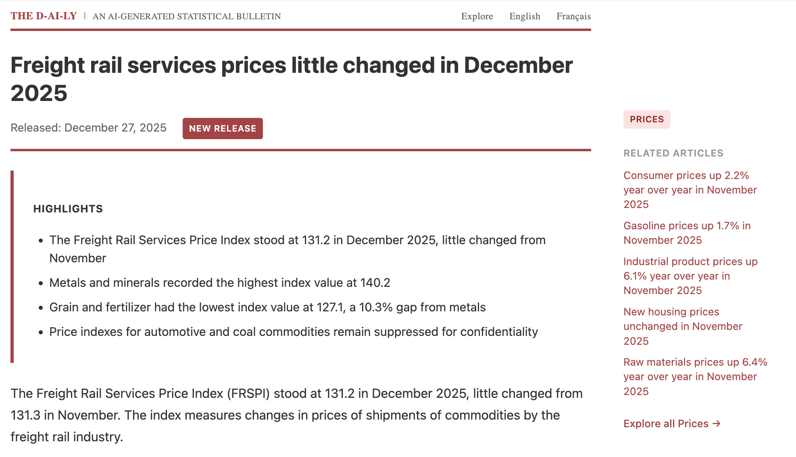
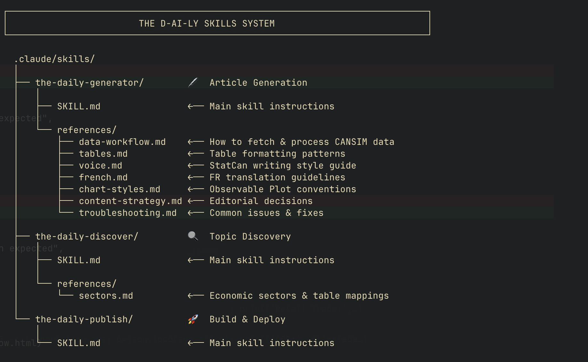

_CANSIM has 60,000+ data tables. StatCan covers a handful at a time in The Daily. What if the marginal cost of coverage was (nearly) zero?_

[The D-AI-LY](https://www.dshkol.com/thedaily/) is an experiment to see how feasible a replication of StatCan's [the Daily](https://www150.statcan.gc.ca/n1/dai-quo/index-eng.htm) would be with Claude Code and a simple skills-based harness. Compared to my other attempts at automating socioeconomic analysis pipelines --[Census Monkey Typewriter](https://www.dshkol.com/post/census-monkey-typewriter-pt2-multiagent/) and CMT2 (*coming soon*). My assumption was that this should be a bit more straightforward: the purpose of The Daily releases is to disseminate updates to the many statistical series StatCan is responsible for -- the voice and tone is both neutral and authoritative, and there's rarely an emphasis on establishing causal relationships from the data.

In practice, it took a few iterations to get things to work correctly. My first attempt resulted in a system that simply browsed StatCan's own releases and gave me 10 consecutive monthly CPI releases. Without constraints, the model gravitated toward whatever was most prominent and most frequently updated, deliberately and lazily avoiding working with raw CANSIM data. 

Building a monthly CPI or LFS release with a bit of narrative is trivial -- the dataset is not complicated, monthly changes are minor, and the narrative generally leaves little room for speculation or curiosity. You could probably one-shot this with a prompt to any of the leading models, site and all; however, I wanted a specific look and feel, a consistent voice and tone, and more serendipity in topic selection. 

CANSIM is a rich and continuously updating repository of statistical content, so part of the goal was to flesh out a discovery approach that would cover a greater breadth of content than StatCan would cover in their releases, in addition to the benefit of nearly instant generation as soon as any data series are updated. 

But I'm not trying for a one-shot flex. I'm trying to replicate an overall publishing system, and that requires predictable determinism and consistency in the execution even when the content is autonomously generated. This is implemented via tools and skills. 

### Tools and Skills

  _tl;dr: Tools give Claude specific capabilities. Skills give Claude repeatable workflows._

  Ask any current-gen chat interface what the latest Canadian CPI reading is and it'll use web search to find the answer. CPI is high-frequency, high-prominence—easy to surface from news coverage. But these systems still struggle to do quantitative research work strictly as a language model. 

  Where we get take-off is with tool use, and tool use effectiveness depends on availability of useful tools.

  Fortunately, we already have the right tool for this project: a well-documented [R package](https://mountainmath.github.io/cansim/) designed specifically to work with the CANSIM API. The `cansim` package provides functions for data and metadata discovery and retrieval—exactly what's needed to programmatically access StatCan's statistical data.

  Claude Code can execute R scripts, read their outputs, and act on the results. The model writes the analysis code; the R runtime executes it against real data; the model interprets the output and writes the narrative. Every value traces back to an actual API response, and every data retrieval and transformation step documented in preserved R code. 

  In my earlier Census Monkey Typewriter project, I stumbled onto a rudimentary version of continuous learning: the system would document its own workflow learnings with each iteration and use those to fine-tune execution. This worked up to a point. I quickly ran into context window limits, and context rot degraded performance before I hit the limits.

  [Skills](https://github.com/anthropics/skills/tree/main) solve this differently. Instead of greedily accumulating context, skills are more surgical. They "teach Claude how to complete specific tasks in a repeatable way"—but, crucially, they benefit from progressive disclosure. A skill's instructions only load when the skill triggers, and reference files within a skill only load when relevant. The generator skill has seven reference files covering voice, charts, French formatting, data validation, and more. When generating an English article, the French reference stays unloaded. When generating a simple time series, the complex chart patterns stay dormant. Precious context space is preserved along the way, even when referencing what are otherwise specific (and verbose) execution instructions.

At it's core, The D-AI-LY is essentially just three Claude Skills that together form a complete editorial pipeline: 

`DISCOVER → GENERATE → PUBLISH`

Each skill operates independently but is designed to pass an artifact to the next one. Discover sends a JSON data object with table details to GENERATE which then sends markdown files to PUBLISH. Within each skill is a combination of detailed fine-tuning instructions (e.g. Table taxonomy, cansim R package documentation, visual standards, narrative tone and voice) and reference examples to draw on. Each skill is invoked progressively, with the idea that skills better manage context scarcity, reduce context rot, and, in turn, enable more deterministic execution of the "How", even if the "What" is autonomously determined. 

#### Skill 1: the-daily-discover ([github](https://github.com/dshkol/thedaily/tree/main/.claude/skills/the-daily-discover))

What it does: 
	1. Scans CANSIM for 1) new releases and 2) underexplored and interesting table categories.
	2. Assigns a scoring heuristic based on recency, narrative potential, public interest, topical diversity, and data quality. Using the heuristic, it generates a prioritization for new articles and a proto hook for the reader. (These scores are assigned by Claude subjectively, and I think that's fine, but I could have been more prescriptive about how to score these.)
	3. Checks against existing tables to avoid duplication and overindex 

This Skill relies primarily on the CANSIM metadata functions in the `cansim` package: `list_cansim_cubes()` to scan all available tables, `search_cansim_cubes()` for keyword discovery, and cube metadata fields like `cubeEndDate` and `subjectCode` to assess recency and sector coverage. The scoring heuristic favors tables that StatCan's own Daily tends to skip like railway carloadings, electricity generation by source, food services receipts. These would not be prioritized in a world where human labour is scarce, but here the marginal cost of creating these releases is next to zero. 

#### Skill 2: the-daily-generator ([github](https://github.com/dshkol/thedaily/tree/main/.claude/skills/the-daily-generator))

This Skill takes the top ranking proposed articles and fetches data using the cansim package from StatCan's API. Each article is both distinct and unique in content but consistent in presentation and tone, with clear guidance and documentation as to how articles should be [generated](https://github.com/dshkol/thedaily/blob/main/.claude/skills/the-daily-generator/references/data-workflow.md) (Observable.js framework), [narrative voice and word choice](https://github.com/dshkol/thedaily/blob/main/.claude/skills/the-daily-generator/references/voice.md) ("report facts without editorial opinion", "no political commentary or implications", and guidance on when to imply causality or when to use hedged connectors), [French translation](https://github.com/dshkol/thedaily/blob/main/.claude/skills/the-daily-generator/references/french.md), and [visual styles](https://github.com/dshkol/thedaily/blob/main/.claude/skills/the-daily-generator/references/chart-styles.md) ("StatCan Red `#AF3C43`, Composition over time → stacked area chart). 

The guidance here comes from a combination of my own assertions and iterative feedback and having Claude (with the Chrome tool) browse through a large number of existing releases on the actual The Daily with instructions to try and pick up on and parse StatCan stylistic choices. 

#### Skill 3: the-daily-publish ([github](https://github.com/dshkol/thedaily/tree/main/.claude/skills/the-daily-publish))

The third skill assembles the generated content, rebuilds the static Observable site with new content, and deploys to production. This skill is the most mechanical and leaves very little for the model to improvise -- practically speaking, this probably didn't even need to be a standalone skill and could've worked as a simple script invoked by the generator skill, but separating concerns made the pipeline easier to debug and iterate on independently. 

### Skills All The Way Down

Each of these three skills are custom developed for this project but they themselves were distilled from working sessions using the `skill-creator` skill, which you can install directly from Anthropic's own skill [repo](https://github.com/anthropics/skills/tree/main/skills/skill-creator).

  The process looks like this, as described by Claude itself:

  1. Start with ad-hoc prompting. Work through the task conversationally. Generate a few CPI articles. Notice what works, what breaks, what needs clarification.

  2. Document learnings in-context. As you iterate, ask Claude to note what patterns emerged. Which chart types work for which data shapes? What headline structures feel right? When does the model reach for hedged language versus direct causation?

  3. Hit the wall. Eventually the conversation gets long. Context rot sets in—earlier instructions get fuzzy, the model starts contradicting itself, outputs become inconsistent.

  4. Crystallize into a skill. Before the context degrades completely, invoke `skill-creator`. Feed it the accumulated learnings and ask it to reconstitute them into a clean, generalizable skill. The messy conversation becomes a structured SKILL.md with organized reference files.

  5. Start fresh. The new skill encapsulates everything learned, but in a form that loads cleanly into a new context window. 

The end result is some form of recursive prompt distillation, trying to strip out as much noise without sacrificing signal. 

### Do Androids Dream of Electricity Generation Tables?

If you've spent any time asking LLMs to work with numbers, you know the failure mode: confident, plausible-sounding statistics with no grounding in reality. Earlier models were particularly bad at this, inventing figures without hesitation. Even current reasoning-tuned models will occasionally bullshit you on statistical outputs. That failure mode is particularly risky and frustrating in a project like this because LLMs will confidently give you plausible-sounding numbers with no grounding in reality, which can be hard to catch without spending nontrivial effort on review. 

Tools and skills help here and The D-AI-LY has several safeguards. Numbers that are generated by way of code interacting with real-world data sources are more likely to be real than something directly spewed by a language model. Skills can include automated checks: 
* JSON schema validation to catch failed fetches and changed table structures*
* Checks for temporal coherence + stale data
* Checks to ensure that narrative and data are in agreement and aligned with JSON object the GENERATOR phase receives
* Visual checks on charts and other graphical content

If a value isn't fetched from StatCan, it doesn't appear. No interpolation, no estimation. This constraint is encoded in the GENERATOR skill's data-workflow reference.

Additionally, every article must include a reproducibility section with working R code and references to the source CANSIM table. These safeguards will catch many mechanical failuares: hallucinated numbers, empty fetches, server errors, broken charts. 

Am I ready to trust this to run fully autonomously as a a National Statistical Agency? No, not yet, but this is a toy example built over a few days of iterative back and forth. I don't think the work required to bring it to that level, or at least to the point where a human's only role is in review/approval, is significant. 

In any case, you should assume the models get better and so does the ecosystem of harnesses and tooling around them and extrapolate accordingly. 